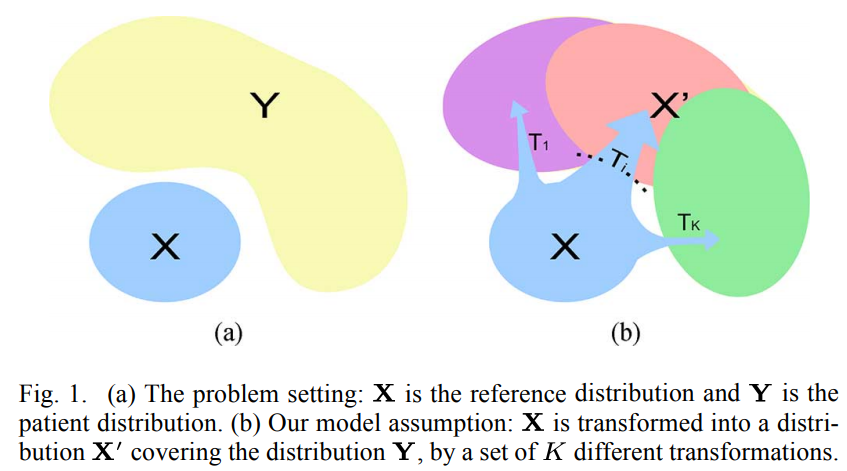

# `CHIMERA`
Since the original repository of [CHIMERA](https://github.com/aoyandong/CHIMERA) is not maintained anymore, the current implementation cleaned the code and upgraded it to python 3.

CHIMERA is a generative model and its core idea is shown below:


## Contributors
Original author: Aoyan Dong

Current maintainer: Junhao Wen

## Installation
[Ananconda](https://www.anaconda.com/products/individual) allows you to install, run and update python package and their dependencies. We highly recommend the users to install **Anancond3** on your machine.
After installing Anaconda3, there are three choices to use CHIMERA.
### Use CHIMERA as a python package (TODO)
We recommend the users to use Conda virtual environment:
```
1) conda create --name CHIMERA python=3.7
```
Activate the virtual environment:
```
2) source activate CHIMERA
```
Install other python package dependencies (go to the root folder of CHIMERA):
```
3) ./install_requirements.sh
```
Finally, we need install CHIMERA from PyPi:
```
3) pip install chimera==0.0.1
```

### Use CHIMERA from commandline (TODO):
After installing all dependencies in the **requirements.txt** file, go to the root folder of CHIMERA where the **setup.py** locates:
```
pip install -e .
```

### Use CHIMERA as a developer version (Recommended for now):
```
python -m pip install git+https://github.com/aoyandong/CHIMERA.git
```

## Input structure
CHIMERA requires a specific input structure inspired by [BIDS](https://bids.neuroimaging.io/).
Some conventions for the group label/diagnosis: -1 represents healthy control (**CN**) and 1 represents patient (**PT**); categorical variables, such as sex, should be encoded to numbers: Female for 0 and Male for 1, for instance.

### Input data format
CHIMERA clusters with ROI features in **feature_tsv** and **covariate_tsv** offers covariate effects, such as age, sex or site (Note that CHIMERA treats site and other covaiates slightly different, i.e., with different distance weights).
Example for **feature_tsv**:
```
participant_id    session_id    diagnosis    ROI1    ROI2 ...
sub-CLNC0001      ses-M00    -1   432.1    596.9
sub-CLNC0002      ses-M00    1    398.2    601.3
sub-CLNC0003      ses-M00    -1    412.0    567.3
sub-CLNC0004      ses-M00    -1    487.4    600.1
sub-CLNC0005      ses-M00    1    346.5    529.5
sub-CLNC0006      ses-M00    1    443.2    663.2
sub-CLNC0007      ses-M00    -1    450.2    599.3
sub-CLNC0008      ses-M00    1    443.2    509.4
```
Example for **covariate_tsv**:
```
participant_id    session_id    diagnosis    age    sex    site...
sub-CLNC0001      ses-M00    -1   56.1    0    1
sub-CLNC0002      ses-M00    1    57.2    0    1
sub-CLNC0003      ses-M00    -1    43.0    1    2
sub-CLNC0004      ses-M00    -1    25.4    1    2
sub-CLNC0005      ses-M00    1    74.5    1    2
sub-CLNC0006      ses-M00    1    44.2    0    3
sub-CLNC0007      ses-M00    -1    40.2    0    4
sub-CLNC0008      ses-M00    1    43.2    1    4
```

## Example
We offer a toy dataset in the folder of **CHIMERA/data**.

```
from chimera.chimera_clustering import clustering
feature_tsv="CHIMERA/data/test_feature.tsv"
output_dir = "PATH_OUTPUT_DIR"
k =2
covariate_tsv="CHIMERA/data/test_covariate.tsv"
clustering(feature_tsv, output_dir, k, covariate_tsv)
```

## Citing this work
### If you use this software for clustering:
> Dong, A., Honnorat, N., Gaonkar, B. and Davatzikos, C., 2015. CHIMERA: clustering of heterogeneous disease effects via distribution matching of imaging patterns. IEEE transactions on medical imaging, 35(2), pp.612-621. [doi:10.1109/TMI.2015.2487423](https://ieeexplore.ieee.org/document/7293208)
